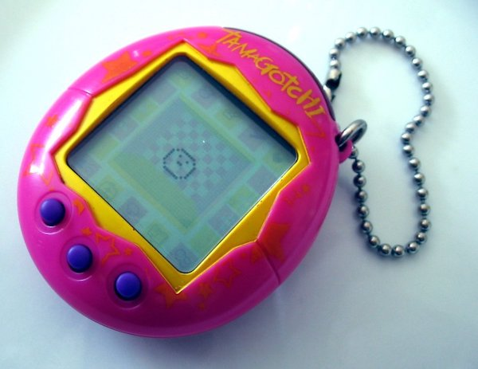
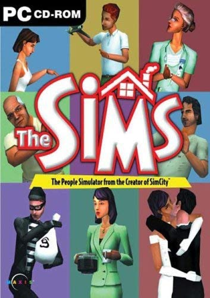
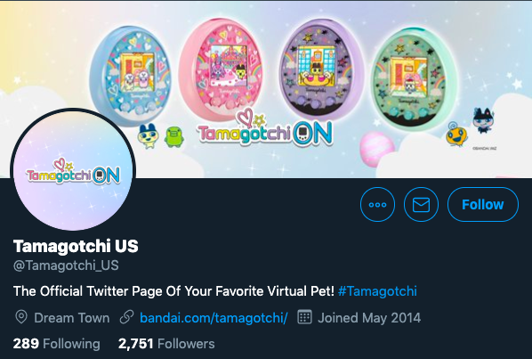

## Winter 1998

Note:
It was Winter 1998; all of the kids at my primary school were playing with this.

---



<small>https://en.wikipedia.org/wiki/File:Tamagotchi_0124_ubt.jpeg - Tomasz Sienicki - CC</small>

Note:
A virtual pet simulation game called Tamagotchi.

---



<small>Electronic Arts</small>

Note:
It was sort of like The Sims of the late 90s but without beautiful graphics and music. Also, the interactions were very limited.

---


Note:
The player was supposed to keep an animal alive.

---


<small>https://twitter.com/Tamagotchi_US</small>

Note:
It seems that Tamagotchis still exist and now are way cooler than in 1998. Depending on the Tamagotchi version you had, you could do various things, but, in general, your options were limited to feeding and playing with the animal.

---


Note:
You had to interact with it a few times a day, so obviously, my Tamagotchi animal was dying all the time.

---


<small>https://unsplash.com/photos/zni0zgb3bkQ</small>

Note:
It could survive a week or two, but I have never seen it stay alive for longer. It was kind of a sad toy.

---

# Winter 2019

Note:
It is 2019. I don't have a Tamagotchi anymore. I wasn't even sure if you could buy a Tamagotchi in 2019 but as you have seen they still exist and sell Tamagotchis.

---

# Plants

Note:
Things have changed. Instead of a Tamagotchi, I have plants.

---


Note:
Not everything has changed because all of my plants keep dying.

---

# I have a problem

Note:
It is time to admit that I have a problem.

---

# Dead

Note:
All of my plants are dead.

---

## Last year


Note:
Look at that one. I kind of hoped that it wasn't dead. I was thinking that it was just preparing for the incoming Winter.

I was wrong. The winter has passed and the plant was still dead.

---


Note:
Here is another one. This time I had no doubts and no hope.
The plant was dead. All of them were dead.

---


Note:
Then, I got a new plant.
This is Zdzislaw - the coolest plant I ever had.

---

<ul>
<li>Venus flytrap</li>
<li class="fragment">likes bugs</li>
<li class="fragment">wants to be a software tester</li>
</ul>

Note:
It is a Venus Flytrap.
It likes bugs. Zdzislaw wants to be a software tester.

---

# H<sub>2</sub>O

Note:
I wanted to keep it alive, but I knew that is wasn't going to be easy.
Even though it is kind of straightforward. The only thing it needs is water.

---

# Keep Zdzisław alive

Note:
I wanted to keep Zdzislaw alive.

---

# Reminders

## Many of them

Note:
I tried reminders. Many of them.
I was never nearby the plant when I saw the reminder and there was always something more urgent to do.

---

# Later = Never

Note:
I was postponing watering the plant. I was going to do it later. Obviously, later, usually means never.

---

## There MUST be something wrong with the plants.

Note:
Obviously, I concluded that there must be something wrong with plants because I never had such problems with animals.

---


Note:
I mean the real animals! Not the fake Tamagotchi pets.

---


Note:
This is Fado. He knows what to do when he wants something. Usually, he kicks his bowl and makes a lot of noise.

---

## Fado can communicate

Note:
Fado can communicate. It may not be the most human-friendly way of communication but it works well.

---

## Let's help Zdzisław communicate

Note:
I wanted to know when I should water the plant so I had to help Zdzislaw communicate.

---

## What do we need?

Note:
I needed a few things.

---

### A little bit of overengineering

Note:
First of all, a little bit of overengineering because there are dozens of methods to water the plant. Most of them are simpler and don't require writing any code.

---

### Ignorance towards 10000 years of agriculture history

Note:
We, humans, know how to take care of a plant. The problem has been solved. There are hundreds of methods. Let's ignore all of that.

---

### Some equipment I will use only once

Note:
I wanted to buy an Arduino and build something with it. Why not a water pump for a carnivorous plant?

---

# IoT

Note:
In the description of my talk, I promised to inspire you to do an IoT project. Let's talk about IoT.

---

### Connecting Arduino to WiFi

```c
#include <WiFiNINA.h>

int status = WL_IDLE_STATUS;

while ( status != WL_CONNECTED) {
    status = WiFi.begin(ssid, pass);
    delay(5000);
}
```

Note:
I started by connecting Arduino to WiFi. Fortunately, there is a great library I could use. All I needed was five lines of code and around 15 seconds. It takes my Arduino around 15 seconds to connect to WiFi. I am not sure if that is normal.

---

## Sending measurements

Note:
To make it at least a little bit cool, I wanted to store measurements in "the cloud."
Nothing fancy. I just built a REST service using a free Heroku instance and used it to store the values in a database.

---

# REST client

Note:
REST client libraries for Arduino are not very popular. Usually, they have only a few stars on GitHub and a couple of forks. I don't like running on my computer some random code downloaded from GitHub, so I wrote my own REST client.

---

# REST client

```c
String request = "POST " + resource + " HTTP/1.1";
String response = "";
  
if (tcpClient.connect(server, port)) {
    #...
}
```

Note:
I needed only one function supporting one HTTP method and one content type. So I just connected to the TCP port...

---

```c
#"POST /some_endpoint HTTP/1.1";
tcpClient.println(request);
tcpClient.println("Host: " + String(server));
tcpClient.println("User-Agent: curl/7.60.0");
tcpClient.println("Accept: */*");
tcpClient.print("Content-Length: ");
tcpClient.println(content.length());
tcpClient.println("Content-Type: application/x-www-form-urlencoded");
tcpClient.println();
tcpClient.println(content);
```

Note:
... and pretended to be a HTTP client. After all, all you need is setting proper headers and sending the content.

---

```c
int waiting = 0;
while(tcpClient.available() == 0 && waiting < 500) {
    waiting++;
    delay(1);
}

while (tcpClient.available() > 0) {
    delay(2);
    char c = tcpClient.read();
    response += c;
}

tcpClient.stop();
return response;
```

Note:
I didn't even need the response from the REST API but printing it was useful for debugging. Because of that I also wrote code that waits for the response and returns it as a string.

---

## Using sensors

Note:
After that, I started reading data from sensors. At this point, I realized that I made a mistake. 

---

<canvas data-chart="line">
<!--
{
 "data": {
  "labels": [1, 2, 3, 4, 5, 6, 7, 8, 9, 10],
  "datasets": [
   {
    "data":[238,195,213,254,211,189,208,247,193,209],
    "label":"Soil humidity",
    "backgroundColor":"rgba(20,220,220,.8)"
   }
  ]
 },
 "options": { "responsive": "true" }
}
-->
</canvas>

Note:
I purchased the cheapest sensors so all my data looked like this.
I have no idea what that noise is. At that time, the sensor was just lying on my desk and I wasn't even touching it.
---

```c
#define SoilHumiditySensor A0

float sensorValue = 0;
for (int i = 0; i <= 100; i++) { 
    sensorValue = sensorValue + analogRead(SoilHumiditySensor); 
    delay(1); 
} 
sensorValue = sensorValue/100.0; 
return sensorValue;
```

Note:
I tried making it less terrible by calculating the average of the last hundred values and using that as the measured humidity. It wasn't much better.

---

# Units? What units?

Note:
Have you noticed that my chart has no unit? I don't know what the unit is and what is the range of possible values.

The manufacturer of the sensors provided some documentation but they forgot to mention anything about units.

---

### All you need is a threshold

```c
float SOIL_HUMIDITY_THRESHOLD = 350;

if(soilHumidity < SOIL_HUMIDITY_THRESHOLD) {
    start_pump();
} else {
    stop_pump();
}
```

Note:
I didn't need to know anything about the units. I just needed to figure out when I should switch on the water pump.
It was kind of disappointing but in the end I just used a constant value as a threshold.
I am sorry if you hoped to see some machine learning.

---

### Using the water pump

```c
#define ENGINE 7

void start_pump() {
  digitalWrite(ENGINE, LOW);
}
```

Note:
The last thing was plugging in the water pump. I could not connect it directly to Arduino because the pump needs higher voltage.

I connected the water pump to its own power source and used Arduino only to switch on and off the power relay.

---


Note:
And here is the water pump and its relay module.

---


Note:
This thing is huge! At this point, I realized that I could not use Arduino to water my plants. The whole thing is too big. Even without the water container.

---

## I have never promised you a happy ending

Note:
All of that didn't matter. It was too late for Zdzisław.

---

# Zdzisław 2.0

Note:
It was time to get Zdzislaw 2.0
This time I will use a smaller Arduino, fewer sensors, and a smaller water pump.

It is going to be different! I mean, I will kill a different plant.

---
## What is the point of all of that?

Note:
Clearly, the project failed. The plant is dead, the water pump is too big and makes too much noise.
So why do I even talk about it?

I do it because if you want to make an IoT project, you need only one thing.

You need an answer to only one question:

---

## If this thing could talk, what would it say?

Note:
If this thing could talk, what would it say?

When you know the answer, everything else becomes easier. Not, the only thing left to do is making that thing talk.

---

### I put a carnivorous plant on the Internet of Things to save its life
### ... and I failed ;)

Bartosz Mikulski
@mikulskibartosz

https://mikulskibartosz.name

Note:
My name is Bartosz Mikulski. I put a carnivorous plant of the Internet of Things and it did not survive.