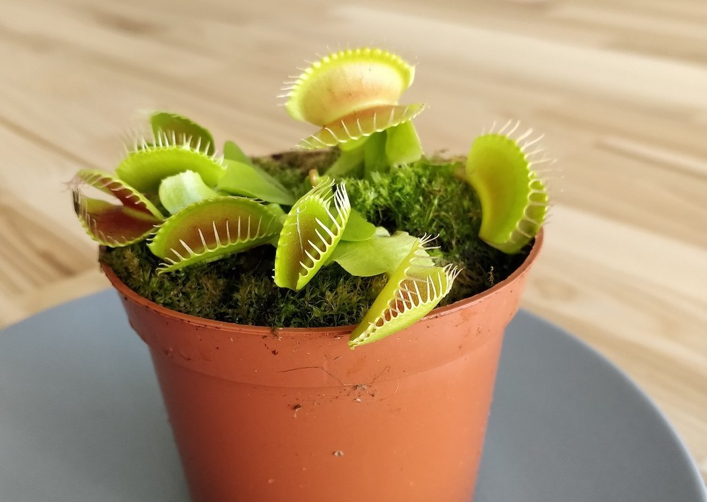

## I had a problem

Note:


---

## All of my plants were dead

---


---

## The one plant

---

# This is Zdzislaw



---

# Zdzislaw

<ul>
<li class="fragment">Venus flytrap</li>
<li class="fragment">likes bugs</li>
<li class="fragment">wants to be a software tester</li>
</ul>

---

## I wanted to keep Zdzislaw alive

---

## I tried reminders

---

## Many of them

---

## But usually there were something more urgent to do

---

## Later == Never

---

## There must be something wrong about plants

---

## I have never had such problems with animals

---

## This is Fado


---

## When he is hungry, he know what to do

--- 

## He kicks his bowl and makes a lot of noise

---

## Fado can communicate
## Zdzislaw can't do that

---

## Let's help Zdzislaw communicate with people

---

## What do we need?

<ul>
<li class="fragment">A little bit of overengineering</li>
<li class="fragment">Ignorance towards 10,000 years of agriculture history</li>
<li class="fragment">some equipement I will use only once</li>
<ul>

---

### Connecting Arduino to WiFi

```c
#include <WiFiNINA.h>

int status = WL_IDLE_STATUS;

while ( status != WL_CONNECTED) {
    status = WiFi.begin(ssid, pass);
    delay(5000);
}
```

---

### Sending measurements

```c
String request = "POST " + resource + " HTTP/1.1";
String response = "";
  
if (tcpClient.connect(server, port)) {
    #...
}
```

---

```c
#"POST /some_endpoint HTTP/1.1";
tcpClient.println(request);
tcpClient.println("Host: " + String(server));
tcpClient.println("User-Agent: curl/7.60.0");
tcpClient.println("Accept: */*");
tcpClient.print("Content-Length: ");
tcpClient.println(content.length());
tcpClient.println("Content-Type: application/x-www-form-urlencoded");
tcpClient.println();
tcpClient.println(content);
```

---

```c
int waiting = 0;
while(tcpClient.available() == 0 && waiting < 500) {
    waiting++;
    delay(1);
}

while (tcpClient.available() > 0) {
    delay(2);
    char c = tcpClient.read();
    response += c;
}

tcpClient.stop();
return response;
```

---

### Using sensors

```c
#define SoilHumiditySensor A0

float sensorValue = 0;
for (int i = 0; i <= 100; i++) { 
    sensorValue = sensorValue + analogRead(SoilHumiditySensor); 
    delay(1); 
} 
sensorValue = sensorValue/100.0; 
return sensorValue;
```

---

### The problem with cheap sensors

<canvas data-chart="line">
<!--
{
 "data": {
  "labels": [1, 2, 3, 4, 5, 6, 7, 8, 9, 10],
  "datasets": [
   {
    "data":[238,195,213,254,211,189,208,247,193,209],
    "label":"Soil humidity",
    "backgroundColor":"rgba(20,220,220,.8)"
   }
  ]
 },
 "options": { "responsive": "true" }
}
-->
</canvas>

---

### Figuring out the measurement thresholds

```c
float SOIL_HUMIDITY_THRESHOLD = 250;

if(soilHumidity < SOIL_HUMIDITY_THRESHOLD) {
    start_pump();
} else {
    stop_pump();
}
```

---

### Using the water pump

```c
#define ENGINE 7

void start_pump() {
  digitalWrite(ENGINE, LOW);
}
```

---

### This thing is huge

---

## I have never promised that this story is going to have a happy ending

---
## It was too late for Zdzislaw

---

# Zdzislaw 2.0

---


## This time it is going to be different.

---

## I mean... I will kill a different plant.

---

# What is the point of all of that?

---

## What is the most important thing in an IoT project?

---

## If this thing could talk, what would it say?

---

### I put a carnivorous plant on the Internet of Things to save its life
### ... and I failed ;)

Bartosz Mikulski
@mikulskibartosz

https://mikulskibartosz.name - deep learning
https://easydata.engineering - data engineering