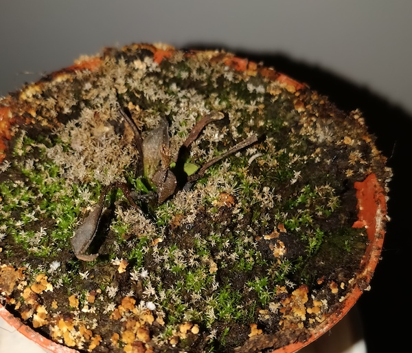

## I had a problem

Note:
My name is Bartosz Mikulski, and I have a massive problem with the plants at my home.

---

## All of my plants were dead

Note:
All of them are dead. I mean... all of them. It seems that growing a plant is just too much for me. 

---



Note:
Look at this one. I kind of hoped that it was not dead. I hoped that this one plant was just preparing for the winter.

It does not look that bad, doesn't it?

So I kept it at the window for a few months. The winter passed, and the plant looked the same. I had to admit that I had killed another one.

---


Note:
Here is another one. This time I had no doubts... and no hope.

The plant was dead. All of them were dead.

---

## The one plant

---

# This is Zdzislaw

---


Note:
Then I got a new one. This is Zdzislaw. It is the coolest plant I ever had.
It is a Venus flytrap. It likes bugs. Zdzislaw wants to be a software tester.

I wanted to keep it alive. I knew it was not going to be easy.
Even though it is kind of straightforward. The only thing you have to do is to water the plant regularly.

---

# Zdzislaw

<ul>
<li class="fragment">Venus flytrap</li>
<li class="fragment">likes bugs</li>
<li class="fragment">wants to be a software tester</li>
</ul>

---

## I wanted to keep Zdzislaw alive

---

## I tried reminders

Note:
So I needed a reminder. I have several of them. That one. And another one. You know what the problem is? I was never nearby the plant when I saw the reminder. 

---

## Many of them

---

## But usually there were something more urgent to do

---

## Later == Never

Note:
There was always something else to do, so I just postponed watering the plants. The problem with doing something later is usually the fact that later means never.

---

## There must be something wrong about plants

Note:
Obviously, I concluded that there must be something wrong with plants.
---

## I have never had such problems with animals

Note:
I never had such problems with animals.
---

## This is Fado

---


Note:
This is Fado. He knows what to do when he wants water. He kicks his bowl and makes a lot of noise.

Fado can communicate what he wants. It may not be the most human-friendly way of communicating, but it works, and he gets what he wants.
---

## When he is hungry, he know what to do

--- 

## He kicks his bowl and makes a lot of noise

---

## Fado can communicate
## Zdzislaw can't do that

Note:
I needed to help Zdzislaw communicate. I wanted to know when I should water the plant.

---

## Let's help Zdzislaw communicate with people

---

## What do we need?

<ul>
<li class="fragment">A little bit of overengineering</li>
<li class="fragment">Ignorance towards 10,000 years of agriculture history</li>
<li class="fragment">some equipement I will use only once</li>
<ul>

Note:
To do it, I needed a few things:
A little bit of overengineering because there are many methods of watering the plants. Most of them are way simpler and don't require writing any code.

I needed to ignore ten thousand years of agriculture history. I am sure that this problem has been solved many times. I wasn't looking for ready-to-use solutions. 

I wanted to buy an Arduino and some electronic equipment I was going to use only once. Because I knew that even when I finish the project, I will not use it daily. It was more like a toy. Something I did for fun.
---

### Connecting Arduino to WiFi

```c
#include <WiFiNINA.h>

int status = WL_IDLE_STATUS;

while ( status != WL_CONNECTED) {
    status = WiFi.begin(ssid, pass);
    delay(5000);
}
```

Note:
I started with connecting Arduino to WiFi. Fortunately, it is a trivial task. In addition to the Arduino code, I also wrote a simple REST service that gathers the measurements and stores them in a database.

---

### Sending measurements

```c
String request = "POST " + resource + " HTTP/1.1";
String response = "";
  
if (tcpClient.connect(server, port)) {
    #...
}
```

Note:
I could download a REST client library from GitHub, but I don't like running some random code downloaded from the Internet on my own computer, so I wrote the code to send HTTP request myself.

Fortunately, It is trivial to make an HTTP request.

---

```c
#"POST /some_endpoint HTTP/1.1";
tcpClient.println(request);
tcpClient.println("Host: " + String(server));
tcpClient.println("User-Agent: curl/7.60.0");
tcpClient.println("Accept: */*");
tcpClient.print("Content-Length: ");
tcpClient.println(content.length());
tcpClient.println("Content-Type: application/x-www-form-urlencoded");
tcpClient.println();
tcpClient.println(content);
```

---

```c
int waiting = 0;
while(tcpClient.available() == 0 && waiting < 500) {
    waiting++;
    delay(1);
}

while (tcpClient.available() > 0) {
    delay(2);
    char c = tcpClient.read();
    response += c;
}

tcpClient.stop();
return response;
```

---

### Using sensors

```c
#define SoilHumiditySensor A0

float sensorValue = 0;
for (int i = 0; i <= 100; i++) { 
    sensorValue = sensorValue + analogRead(SoilHumiditySensor); 
    delay(1); 
} 
sensorValue = sensorValue/100.0; 
return sensorValue;
```

Note:
After that, I started reading data from sensors. At this point, I realized that I made a mistake. I purchased the cheapest humidity sensors. 

---

### The problem with cheap sensors

---

<canvas data-chart="line">
<!--
{
 "data": {
  "labels": [1, 2, 3, 4, 5, 6, 7, 8, 9, 10],
  "datasets": [
   {
    "data":[238,195,213,254,211,189,208,247,193,209],
    "label":"Soil humidity",
    "backgroundColor":"rgba(20,220,220,.8)"
   }
  ]
 },
 "options": { "responsive": "true" }
}
-->
</canvas>

Note:
Those are the values I measured. The sensor was just laying on the desk. I wasn't even touching it. I tried smoothing the values by taking the average value of a hundred measurements. It did not make it much better.

Also what is this value? What is the unit of measurements? What is the range of possible values? I read the documentation provided by the manufacturer. The information I was looking for wasn't there.
---

### Figuring out the measurement thresholds

```c
float SOIL_HUMIDITY_THRESHOLD = 250;

if(soilHumidity < SOIL_HUMIDITY_THRESHOLD) {
    start_pump();
} else {
    stop_pump();
}
```

Note:
This was going to be fun. I decided that I don't need to know what the unit is. I just needed to figure out what is the threshold. I wanted to know when I must switch on the water pump. So I set it to a constant value that seemed to be right. It was good enough.

I had a few sensors: a soil humidity sensor, a water level sensor, air temperature, and a humidity sensor. I needed only to measure the soil humidity, but I used all of them.

---

### Using the water pump

```c
#define ENGINE 7

void start_pump() {
  digitalWrite(ENGINE, LOW);
}
```

Note:
Next, I needed to plug in the water pump. I could not power it using Arduino because the pump needs higher power voltage than the one that is available in Arduino.

I connected the pump to a separate power source. In this case, just a few batteries. Arduino was used only to switch on and off a power relay.

---


---

### This thing is huge

---


Note:
At this point, I realized I can't use that thing. It was too big. I was sure that it was going to be just a fun side project, not something I would be using for real.

---

## I have never promised that this story is going to have a happy ending

Note:
Anyway, I never promised that this story has a happy ending. It was too late for Zdzislaw.

It was time to get Zdzislaw 2.0

This time it is going to be different. Very different.

I mean, I am going to kill a different plant. 

---
## It was too late for Zdzislaw

---

# Zdzislaw 2.0

---


## This time it is going to be different.

---

## I mean... I will kill a different plant.

---

# What is the point of all of that?

Note:
So what is the point of all of that? Clearly, it made no sense to use it. If this problem wasn't already solved, I could say that it was just a cool proof of concept.

But it wasn't it. I could use dozens of plant watering solutions that are simpler to use, don't need so much space, and are not a potential fire hazard.
---

## What is the most important thing in an IoT project?

Note:
I wanted to show you how you can start an IoT project. It seems that the hardest part is to have an idea of what you want to do.

---

## If this thing could talk, what would it say?

Note:
It is not as difficult as you thing. When you look at something, whatever it is, a chair, a plant, a window, anything, ask yourself one question: "if this thing could talk, what would it say?"

When you know the answer to that question, everything else is much easier. Now, you just need to make this thing talk.

---

### I put a carnivorous plant on the Internet of Things to save its life
### ... and I failed ;)

Bartosz Mikulski
@mikulskibartosz

https://mikulskibartosz.name - deep learning
https://easydata.engineering - data engineering